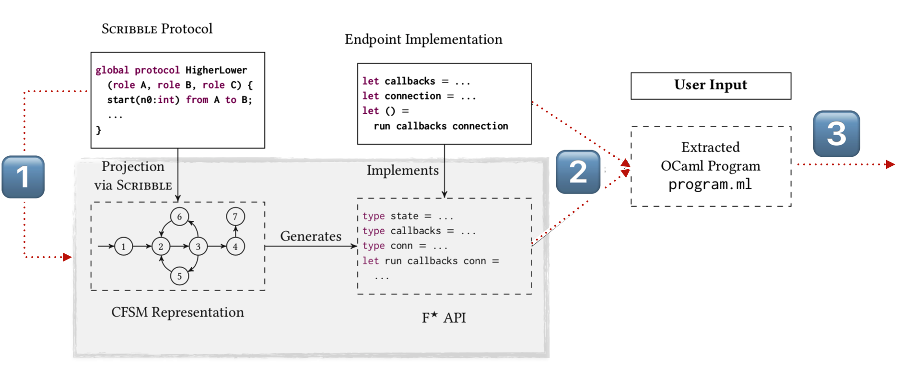

# OOPSLA '20 Artifacts #11 - README.md

> *Statically Verified Refinements for Multiparty Protocols*
>
> Fangyi Zhou, Francisco Ferreira, Raymond Hu, Rumyana Neykova and Nobuko Yoshida

Our [paper](...TODO...) presents **Session&#42;**, a toolchain for
specifying message passing protocols using **Refined Multiparty Session Types**
and safely implementing the distributed endpoint programs in **F&#42;**.

This artifact submission contains the following:

- An [overview](...TODO...) of the artifact (this document).
- The main artifact, a [Docker image](...TODO...).
- The md5 hash of the artifact file is TODO.

For better usability, please use the [online](...TODO...) version of this document.

# Artifact Overview


This overview describes the steps to assess the practical claims of the
paper using the artifact.

1. **[Getting Started](#getting-started)**  
    - [1.1](#run-the-artifact) Run the Artifact (Docker image)  
    - [1.2](#artifact-layout) Artifact Layout  
    - [1.3](#quick-test) Quick Test  
        - [1.3.1](#run-all-examples) Run all examples  
        - [1.3.2](#run-table-1) Run the benchmarks for Table 1 (Sections 5.2 and 5.3 in the paper).   
        - [1.3.2](#run-table-2) Run the benchmarks for Table 2 (Section 5.4 in the paper).
2. **Step-by-Step Instructions**  
    [2.1](...TODO...) Run and verify the benchmarks for Table 1 (Sections 5.2 and 5.3 in the paper).  
    [2.2](...TODO...) Run and verify the example listed in Table 2 (Sections 5.4 in the paper).  
    [2.3](...TODO...) Run the main example (HigherLower) of the paper (Section 2 in the paper).  
    [2.4](...TODO...) Modify examples and observe refinement violations  
    [2.5](...TODO...) Run Through Other Examples (Optional)
3. **Additional Information**  
    [3.1.](...TODO...) ...toolchain overview  
    &nbsp;&nbsp;&nbsp;&nbsp;[3.1.1.](...TODO...) ...discrepancies between the artifact and the paper  
    &nbsp;&nbsp;&nbsp;&nbsp;[3.1.2.](...TODO...) ...Syntax of Refined Scribble  
    [3.2.](#step-2-observe-refinement-violations) ...implementing your own
          protocols ...you can test and modify any of the above example, as well as
          implement and verify your own protocols using our toolchains  
    [3.3.](#step-3-run-other-example-optional) ...debugging tips


---  
---
## <a name="getting-started"></a> 1. Getting Started

---
### <a name="run-the-artifact"></a> 1.1 Run the Artifact (Docker Image)

For the OOPSLA'20 artifact evaluation, please use the docker image provided:

**TODO: Replace with how to unzip the docker image and run.**

0. [Install docker](https://docs.docker.com/engine/install/).
1. Download the artifact file (assume the filename is `artifact.tar.gz`)
2. Unzip the artifact file.
    ```bash
    gunzip artifact.tar.gz
    ```
3. You should see the tar file `artifact.tar` after last operation.
4. Load the docker image
    ```bash
    docker load < artifact.tar
    ```
5. You should see in the end of the output after last operation: **TODO: Change the tag**
    ```
    Loaded image: docker.pkg.github.com/sessionstar/oopsla20-artifact/artifact:latest
    ```
6. Run the docker container:
    ```bash
    docker run -it docker.pkg.github.com/sessionstar/oopsla20-artifact/artifact:latest
    ```
7. The Docker image comes with an installation of vim and nano for editing.
   If you wish to install additional software for editing or other purposes, you may obtain sudo
   access with the password `sessionstar`.
8. The instructions in this overview assume you are in the
   `/home/sessionstar/examples` directory.  ...**CHECKME**: e.g., next subsec
   - Note.  This document contains some folded paragraphs:
        <details>
        <summary>
           <b>Click</b> to unfold...
        </summary>
        ...and see the details.
        </details>


### <a name="artifact-layout"></a> 1.2. Artifact Layout

The artifact is built from this [commit](...TODO:https://github.com/sessionstar/oopsla20-artifact...)
in the sessionstar [GitHub](https://github.com/sessionstar/oopsla20-artifact) repository.  

The artifact contains the following:
* The directories `scribble-java` and `ScribbleCodeGenOCaml`
  comprise the full source code of the toolchain.
    * The `sessionstar` command, available on the command line `$PATH`,
      performs the Scribble protocol to F* API generation (e.g. the F*
      callback signatures); see [Part II (Step I)](...TODO...).
* The directory `FStar` contains a checkout of the F* compiler, patched to
  enable `TCP_NODELAY` flag for benchmarking purposes.
* The directory `examples` contains the source code for the various examples,
  including the HigherLower running example from the paper (Section 2) and
  those listed in Table 2 in the paper.
  * The sub-directory `scripts` contains scripts for executing the
    benchmarks from Table 1 and Table 2 in the paper.
* The directory `/template` contains template files to help you through writing
  and testing your own examples.


---
### <a name="quick-test"></a> 1.3. Quick Test

We provide several scripts that allow you to quickly run the main examples of the paper.

A step by step explanation on how to verify the claims of the paper, how to use the toolchain,
and how to test each example separately is deferred to later sections (&#167;2 and &#167;3) of this document.

#### <a name="run-all-examples"></a> 1.3.1 Test that at all examples can be executed
To verify and execute all implemented examples:

```bash
cd examples
make
make run
```
&#167; 3.1 explains how to run each example separately.

---
#### <a name="run-table-1"></a> 1.3.2  Run the benchmarks for Table 1 (Sections 5.2 and 5.3 in the paper).   
To execute the benchmark experiment once:

```bash
python3 scripts/pingpong.py
```

The produced table corresponds (up to column renaming) to Table 1 from the paper.

(**TODO:** explain the script arguments: 1. explain the option to adjust n, 2. option to adjust how many times the example are run; 3.explain the option to run remotely)

&#167; 2.1 explains in details how to compare the produced results with the paper.

---
#### <a name="run-table-2"></a> 1.3.3 Run the benchmarks for Table 2 (Section 5.4 in the paper).

To compile all applications implemented with **Session&#42;** (Table 2):

```
python3 scripts/examples.py
```

The produced table corresponds (up to column renaming) to Table 2 from the paper.

&#167; 2.2 explains in details how to compare the produced results with the paper.

---  
---

## 2. Step-by-Step Instructions

The purpose of this section is to describe in details the steps required to assess the artifact associated with our paper. We would like you to be able to:

* reproduce our benchmarks from Table 1, Section 5.2 and 5.3. For that purpose, complete &#167;[2.1](...TODO...) of this document.
* compile the examples, reported in Table 2, Section 5.4. For that purpose, complete &#167;[2.2](...TODO...) of this document.
* test the running example (HigherLower) from the paper, described in Section 2. For that purpose, complete &#167;[2.3](...TODO...) of this document.

Additionally, you can test and modify any of the examples we have implemented (&#167;[2.4](...TODO...)), as well as implement and verify your own protocols (&#167;[3.1](...TODO...)) using our toolchain.

**Note on performance:** Measurements in the paper are taken using a machine with Intel i7-7700K CPU (4.20 GHz,
922 4 cores, 8 threads), 16 GiB RAM, operating system Ubuntu 18.04.
Depending on your test machine, the absolute values of the measurements produced in &#167;[2.1](...TODO...) and &#167;[2.2](...TODO...) may differ slightly from the paper. Nevertheless, the claims stated in the paper should be preserved.  

#### 2.1.  Run and verify the benchmarks for Table 1 (Sections 5.2 and 5.3).

The purpose of this set of benchmarks is to demonstrate the scalabilty of our tool on protocols of increasing length (as explained in Section 5.2). We also measure the execution overhead of our implementation by comparing it against an implementation without session types or refinement types, which we call bare implementation (as explained in Section 5.3).

To reproduce the benchmarks reported in the paper run the script with an argument of 30 (**TODO: (verify the argument and what it means**). Note that the script will take a considerable time to complete **TODO: (how much approx: XXX)**:

```
python3 scripts/pingpong.py 30
```

Compare the results with the results reported in Table 1, taking into account that the absolute values may differ. Verify the associated claim (Section 5.3, line 971-972):

> Despite the different protocol lengths, there are no significant changes in execution time

The produced table contains the following columns. In brackets we give the name of the corresponding columns from Table 1.
* ```Gen Time (CFSM)``` - the time taken for Scribble to generate the CFSM (```CFSM```)
* ```Gen Time (F\*)``` - the time taken for the code generation tool to convert the CFSM to F\*. (```F\* APIs```)
* ```TC Time (Gen.)``` - the time taken for the generated APIs to type-check in F\⋆(```Gen. Code```)
* ```TC Time (Impl)``` - the time taken to time check the implementation (```Callbacks```)


The script runs the example 30 times and displays the average.

(TODO: 1. explain the option to adjust n, 2. option to adjust how many times the example are run; 3.explain the option to run remotely)

**Note:** The result in the paper run the experiments under a network of latency of 0.340ms (64 bytes ping), while the script runs the examples in the same docker container.  


---
#### 2.2. Run and verify the example listed in Table 2 (Sections 5.4).

The purpose of these set of benchmarks is to show the expressivity of our toolchain. We have taken examples
from the session type literature, and have added refinements to encode data dependencies in the protocols (as explained in Section 5.4).

To run all examples at once:
```
python3 scripts/examples.py
```
Compare the results with the results reported in Table 2, taking into account that the absolute values may differ.

The produced table corresponds to Table 2 from the paper.
It contains the same columns as the table produces in &#167;[2.1](...TODO...) Note that Table 2 from the paper reports:
- the total generation time, which is a sum of the ```Gen Time (CFSM)``` and ```Gen Time (F*)``` from the produced table.
- the total time checking time, which is a sum of ```TC Time (Gen.)``` and ```TC Time (Impl)``` from the produced table.

The source code (protocols and implementations) for each of these examples is located in a separate folder. See &#167;[2.4](...TODO...) for details on how to run each of the examples.  

---
#### 2.3.  Run the main example (HigherLower) of the paper (Section 2).
The purpose of this section is to give you a quick walk through of using the toolchains to implement and verify a protocol. We focus on the running example - [HigherLower.scr](/examples/HigherLower).
For high-level overview of the toolchain refer to   &#167;[3.1](...TODO...)

:one: **Generate.**
The first step of our toolchain is the generation of callback signatures from Scribble protocols. The ```sessionstar``` command takes a file name, a protocol name and a role. To generate the callback file for role A for the HigherLower protocol, i.e ```HigherLower/HigherLower.scr```:
 ```
 sessionstar HigherLower/HigherLower.scr HigherLower A
 ```
 The ```sessionstar``` command  (1) generates a CFSM and (2) produces the callback signatures in F*. It produces the corresponding files:
   -  ```HigherLower_A.fsm``` - contains the CFSM for role A  
   -  ```GeneratedHigherLowerA.fst``` - contains the generated API, as callback signatures, for role A.

:two: **Implement and compile.**
A user has to implement the program logic for each callback from the generated API file (```GeneratedHigherLowerA.fst```).

<!-- A sample implementation of role A is given in ```HigherLower/HigherLowerA_CallbackImpl.fst```. -->

After we implement the program logic for role A  using the callback signatures produced in the previous step, we can verify that the implementation is correct by running the F* type checker.

 A sample implementation of role A is given in ```HigherLower/A/HigherLowerA_CallbackImpl.fst```. To compile this implementation for endpoint A, we first move the generated file to the correct folder, and then we build the endpoint using the F* compiler:
```
mv GeneratedHigherLowerA.fst HigherLower/A
make -C HigherLower/A main.ocaml.exe
```
 The above command generates the binary for role A,  ```main.ocaml.exe```.


:three: **Execute.**
Repeat the above steps (generation and compilation for role B and C). After all endpoints have been implemented and their binaries have been generated, we can run them.
 To run all endpoins issue all the commands:
```
HigherLower/B/main.ocaml.exe &
HigherLower/C/main.ocaml.exe &
HigherLower/A/main.ocaml.exe &
```
 The above command runs the three endpoins, i.e A, B and C.


---
#### 2.3.  Observe Refinement Violations

Next we highlight how protocol violations are ruled out by static refinement typing, which is ultimately the practical purpose of **Session&#42;**.

(a) **Refinement violations:** Change the implementation for role B.
Below we suggest two modifications.

 First, ensure that the current implementation is correct:
```
sessionstar HigherLower/HigherLower.scr HigherLower C
mv GeneratedHigherLowerC.fst HigherLower/C
make -C HigherLower/C main.ocaml.exe
```
  After each modification, compile and observe that an error is reported. Note that since we are not changing the protocol, you do not need to run sessionstar again, it is enough to run the F* type checker using ```make -C HigherLower/C main.ocaml.exe```

 Suggested modifications:
 - Modify the condition for the lose case ([Line 32](https://github.com/sessionstar/oopsla20-artifact/blob/4061441dbdea9cb4ec7567af4e0efb2390174359/examples/HigherLower/B/HigherLowerB_CallbackImpl.fst#L32)) from ```t >0``` to ```t=0```

 - Comment the lose case ([Line 32-33](https://github.com/sessionstar/oopsla20-artifact/blob/4061441dbdea9cb4ec7567af4e0efb2390174359/examples/HigherLower/B/HigherLowerB_CallbackImpl.fst#L32)).
Note: the syntax for comments in F* is (* commented code *).

(b) **Use of proof-irrelevant variables:** To demonstrate how our toolchain uses reasoning with latent information, we will modify the protocol HigherLower, and we will compile the  implementation for role C.

First, we verify that the implementation of C is correct:
```
sessionstar HigherLower/HigherLower.scr HigherLower C
mv GeneratedHigherLowerC.fst HigherLower/C
make -C HigherLower/C main.ocaml.exe
```
Suggested modifications:
  - Modify the implementation such that the higher case sends a variable that is lower than the current one. For example change Line [34](https://github.com/sessionstar/oopsla20-artifact/blob/4061441dbdea9cb4ec7567af4e0efb2390174359/examples/HigherLower/C/HigherLowerC_CallbackImpl.fst#L34) from ```next := (Mkstate72?.x st) + 1)``` to ```next := (Mkstate72?.x st) - 1)```. Compile the endpoint (```make -C HigherLower/C main.ocaml.exe```) to observer an error.

  - Modify the protocol by removing all constraints for x that depend on n.
    - Change [Line 19](https://github.com/sessionstar/oopsla20-artifact/blob/4061441dbdea9cb4ec7567af4e0efb2390174359/examples/HigherLower/HigherLower.scr#L19) from ```@'n>x && t>1'``` to ```@'t>1'```
    - Change [Line 23](https://github.com/sessionstar/oopsla20-artifact/blob/4061441dbdea9cb4ec7567af4e0efb2390174359/examples/HigherLower/HigherLower.scr#L23) by commenting ```n=x'``` (comment in Scribble is \\\ )
    - Change [Line 30](https://github.com/sessionstar/oopsla20-artifact/blob/4061441dbdea9cb4ec7567af4e0efb2390174359/examples/HigherLower/HigherLower.scr#L30) from @'((n<x || n>x) && t=1)' to ```@'t=1'```

   Since we changed the protocol, new callback signatures have to be generated. Generate new callback signatures and compile:     
 ```
 sessionstar HigherLower/HigherLower.scr HigherLower C
 mv GeneratedHigherLowerC.fst HigherLower/C
 make -C HigherLower/C main.ocaml.exe
 ```

#### :exclamation:__Note__ on syntax discrepancies:

There are small syntax discrepancies between Scribble syntax and the paper.

TODO: A quick explanation on the main differences...

For details, see the [notes on Scribble syntax](README.md#notes-on-scribble-syntax).


---
#### 2.4. Run Through Other Examples (Optional)

To build a selected example from Table 2:
```
make build-[name of the example]
```

To run a selected example from Table 2:
You can run them using:
```
make run-[name of the example]
```

See the [Makefile](examples/Makefile) for more details.  

Each examples is in a separate folder. The folder contains:
- The protocol, specified in Scribble - a file with extension .scr
- a folder for each role in a protocol. Each role folder contains:
  - Generated API file (automaticaly generated by the toolchain) - the name convention of such files is Generated[ProtocolName][RoleName].fst. Note that this file will be generated only after running the ```sessionstar``` command on the target protocol.
  - Callback Implementation file (specific to the implementation, should be implemented by the user)- the name convention of such files is [ProtocolName][RoleName]_CallbackImpl.fst
  - Boilerplate files (non-specific to the implementation):
    - Payload.fst - specifies serialisation of the payload types (e.g int, strings)
    - Network.fst - standard communication functions for send/receive


Below we briefly explain each example:
<details>
  <summary>Two Buyer</summary>

- source folder:  [examples/TwoBuyer](examples/TwoBuyer)
- explanation:Two Buyer is a canonical example for demonstrating business logic interactions. It specifies a negotiation between two buyers and a seller to purchase a book. The Seller S sends the price of the book to Buyer A and Buyer B. The refinement ensures that the seller quotes the same price to both buyers. A and B negotiate and buyer B accepts to buy the book only if A contributes more to the purchase.  

</details>
<details>
  <summary>Negotiation</summary>

- source folder:  [examples/Negotiation](examples/Negotiation)
- explanation: This is a recursive protocol that describes a service agreement proposal between a producer P and a consumer C. The protocol starts by the producer P sending an initial proposal to C, the proposal contains the price of the service. Then C can either accept the proposal, or can send a counter proposal.
The refinements ensure that when an offer is accepted the confirmed price and the offer price are the same.

</details>
<details>
  <summary>Fibonacci</summary>

- source folder:  [examples/Fibonacci](examples/Fibonacci)
- explanation: The protocol specify a computation of a fibonacci sequence. The specified refinements ensure that each number (produced by role B) is the sum of two preceding numbers (provided by role A). Hence, the implementation is guaranteed to compute a fibonacci sequence.

</details>
<details>
  <summary>Travel Agency</summary>

- source folder:  [examples/TravelAgency](examples/TravelAgency)
- explanation: This is a W3C Choreographies use case, and the running example from [Hu et al. 2008](https://doi.org/10.1007/978-3-540-70592-5_22). The protocol depicts the interactions between a client (C), the travel agency (A)
and a travel service (S). Customer requests and receives by the Agency the price for a desired journey. This exchange may be repeated an arbitrary
number of times for different journeys under the initiative of Customer.
Customer either accepts an offer from Agency or decides that none of the
received quotes are satisfactory. If the offer is accepted, the
Service handles the payment.

</details>
<details>
  <summary>Calculator</summary>  

- source folder:  [examples/Calculator](examples/Calculator)
- explanation: a distributed service for addition of two numbers. The recursive protocol allows a client to repeatedly send an operation request (e.g addition) with two numbers, and receive back the result (the sum of the two numbers).

</details>
<details>
  <summary>SH</summary>

  - source folder:  [examples/SH](examples/SH)
  - explanation:  SH is short for Sutherland-Hodgman algorithm. It is a 3-role protocol for polygon clipping. It takes a plane, and the vertices of a polygon as a series of points; and produces vertices for
the polygon restricted to one side of the plane. This is the running example from [Neykova et al. 2018](https://doi.org/10.1145/3178372.3179495)

</details>
<details>
  <summary>OnlineWallet</summary>

- source folder:  [examples/Online Wallet](examples/OnlineWallet)
- explanation: This is the running example from [Neykova et al. 2013](https://www.doc.ic.ac.uk/~rn710/spy/main.pdf).
It represents an online payment application between client C, bank S, and an Authentication service A. In each iteration, S
sends C the current account status,
and C has the choice to make a payment (but only for an amount that
would not overdraw the account) or end the session.

</details>
<details>
<summary>Ticket</summary>

- source folder:[examples/Ticket](examples/Ticket)
- explanation: This is the running example from [Bocchi et al. 2013](http://mrg.doc.ic.ac.uk/publications/a-theory-of-design-by-contract-for-distributed-multiparty-interactions/concur.pdf), where a buyer negotiates with the seller and bank for buying a purchase.
The refinements ensure that the buyer has to increase the price during
negotiations until an agreement is reached. In addition, the value of the (last) offer and the payment must be equal.

</details>
<details>
  <summary>HTTP</summary>

- source folder:  [examples/HTTP](examples/HTTP)
- explanation: It is a minimal specification of the [Hypertext Transfer protocol](https://tools.ietf.org/html/rfc2616) protocol. The refinements ensure the validity of the status code that are used. We have  implemented an HTTP server in F*. The example can interoperate with HTTP clients, e.g Chrome, Firefox, etc.

</details>  


---  
---
## 3. Additional Information

---
#### 3.1. Toolchain Overview

The following is a quick recap of the **Session&#42;** toolchain, as
presented in the paper.

**In a nutshell.**
The toolchain allows users to specify, implement and verify <em>refined</em>
multiparty protocols and programs.  Protocol specifications are based on our
Refined Multiparty Session Types (RMPST), which express data dependent
protocols via refinement types on interactions and message payloads, i.e.,
protocols with logical constraints on message value and control-flow.

**How.**
Users write protocol specifications in our extension of the
[Scribble](scribble.org) protocol description language, and implement the
endpoint programs in [F*](fstar.org) using refinement-typed APIs generated from
the protocol by the toolchain.  The F* compiler statically verifies each
endpoint program and its refinements to ensure that the program follows the
protocol.

The steps of the toolchain, as exercised in [2.1](...TODO...), are outlined
below (the figure corresponds to Fig. 2 in the paper).  

</img>

The **Session&#42;** starts by writing the protocol in our extended Scribble:
this artifact supplies the protocols for all the examples in the paper.
This overview then runs through the following steps.

- :one: **Generate** -- for each role in a given Scribble protocol, we generate
  an F* API for implementing that role (by way of a CSFM representation).
  This is done using the ```sessionstar``` command, which is available on the
  command line path in the artifact conatiner and produces the following files.  
  Outputs: (a dot file representation of the CFSM) and an F* API file.  
- :two: **Implement and compile** -- the user supplies the application logic
  for each endpoint by implementing the I/O callback function types of the
  generated API.  The implementation is verified by the F* compiler.  
  Outputs: executable binaries.
- :three: **Execute** -- with a well-typed endpoint program for each role, we
  can execute the protocol.  For this artifact, we run all endpoints within the
  same container as separate processes communicating asynchronously via TCP
  localhost (i.e., with the same communication semantics as geographically
  distributed TCP connections).  
  Outputs: safe execution of the refined multiparty protocol.

**Properties of the toolchain.**
The paper (Section 4) establishes Trace Equivalence (Theorem 4.8) between
global protocols and endpoint projections, and Preservation of Well-Formedness
(Theorem 4.10) and Progress (Theorem 4.11) for well-formed global protocols.
Our toolchain confers these properties to a system of well-typed endpoint
programs with the following notes.
- By default, the APIs generated by our toolchain permit the arbitrary `ML`
  effect of F* in I/O callbacks.  Technically, this allows an endpoint program
  to locally feature, e.g., exceptions, which might in turn impact the progress
  of its peer programs.  Nevertheless, there are useful and "non-harmful"
  effects, such as **..printing and refs..**  Alternatively, the APIs could be
  generated with stricter effect constraints (the strictest being `Tot`, for
  terminating expressions without side-effects).
- The above point concerns progress.  **..Regardless, our toolchain guarantees that
  execution is free of communication errors and deadlocks..**.  (Deadlock refers
  to the safety error of a wait-for cycle between two or more endpoints.)


#### 3.1.1.  Discrepancies between the Paper and the Artifact

There are a few discrepancies between the implementation of our extended
Scribble in the artifact and that presented in the paper.

- There are small syntactic differences.
    - Refined state variable declarations were written in the paper: e.g.,
      Fig. 3
      ```
      aux global protocol Aux(role A, role B, role C)
                                          @'B[n: int{0<=n<100}, t: int{0<t}]
      ```
      whereas the implementation in the artifact requires syntax like:
      ```
      aux global protocol Aux(role A, role B, role C)
                          @'B[n: int = 0, t: int = 1] (0<=n && n<100) && 0<t
      ```
      The syntax in our implementation declares state variables with a default
      initial expression (which happen to be irrelevant to the HigherLower
      example), and the refinements of each variable are written as a
      combined assertion following the declarations.
    - The code in the paper uses some compacted notation (e.g., &leq;, &wedge;)
      which the implementation requires in longer form (e.g., `<=`, `&&`).
- Our implementation of Scribble includes an additional protocol validation
  step prior to the F* API generation. **..This validation is an optional
  bonus, and is not required to support the properties described above...**


##### 3.1.2. Syntax of Refined Scribble

Our extended Scribble is based on the global types of our Refined MPST as
defined in the paper (Section 4).  The syntax and key features are already
mostly demonstrated by the HigherLower example ([2.1](...TODO...)).
The following summarises the syntax using another compact example.

```
module Foo;  // Corresponds to the file name, i.e., Foo.scr

type <fstar> "..." from "..." as int;  // The "..." are currently irrelevant

// A "main" protocol
global protocol MyProto(role A, role B, role C) {
    // Interaction sequences -- with payload variables and refinements
    1(x1: int) from A to B;        @'x1>0'
    2(x2: int) from A to C;        @'x2=x1'
    // A subprotocol -- essentially inlined
    do MyProtoAux(A, B, C);        @'B[x1] C[x2]'  // State variable arguments
}

// "aux" protocols are used as subprotocols from main protocols
aux global protocol MyProtoAux(role A, role B, role C)
                                   // State variable declarations and assertion
                                   @'B[xB: int = 0] C[xC: int = 0] xB>=0' {
    // "Directed" choice -- refinements specify control flow as well as message values
    choice at B {
        2(curr: int) from B to C;  @'xB>0 && curr=xB'
        3(orig: int) from C to A;  @'orig=xC'
        // A (tail) recursive subprotocol -- translated: \mu X ... X
        do MyProtoAux(A, B, C);    @'B[xB-1] C[xC]'
    } or {
        Bye() from B to C;         @'xB=0'
        Bye() from C to A;
        // End of protocol
    }
}
```

- Usability warning:  Our current implementation is not very user friendly.
  Many errors are reported with a full stack trace -- you may find a basic
  error message at the top of the trace.
- To match our RMPST in the paper, choices must be **directed**: this means the
  initial messages inside each choice case must be sent from the choice subject
  (the `at` role) to the *same* role in all cases.
    - Our implementation expands slightly on the core theory presented in the
      paper by allowing a so-called merge of "third-party" branch cases with
      *distinct* labels in projection.  E.g., for the third-party `C`
      ```
      choice at A {
          1() from A to B; 2() from A to C;
      } or {
          3() from A to B; 4() from A to C;
      }
      ```
      This is a common extension in the
      literature, e.g., [Yoshida et al.](https://link.springer.com/chapter/10.1007/978-3-642-12032-9_10)
- Regarding refinements, ...**int only?**  The basic operations that we
  currently support in refinements include: comparisons (`<`, `<=`, `=`, `>=`,
  `>`), addition (`+`) and connectives (`&&`, `||`).  We can readily extend
  with additional sorts and functions based on what Z3 supports.


---
#### 3.2. Implementing your own protocols (Optional)

...**CHECKME**: maybe move to part 2

Create a simple calculator protocol, following the short tutorial here.

Hint: If you are struggling, the Calculator folder contains the full implementation, and you can use it for reference.


---
#### 3.3. Additional information (Debugging tips)
* If you have problems compiling the examples, try:
  * rm .depend;
  * make clean-[example-name]
* A socket error ECONNREFUSED:
  * the error indicates that you have not started the roles in the expected order, you should always start the server role first.
<!-- P.S The (current) readme is here https://github.com/fangyi-zhou/FluidSession -->
